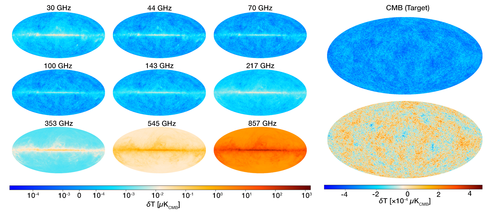
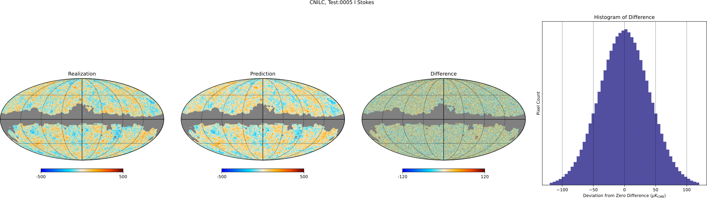
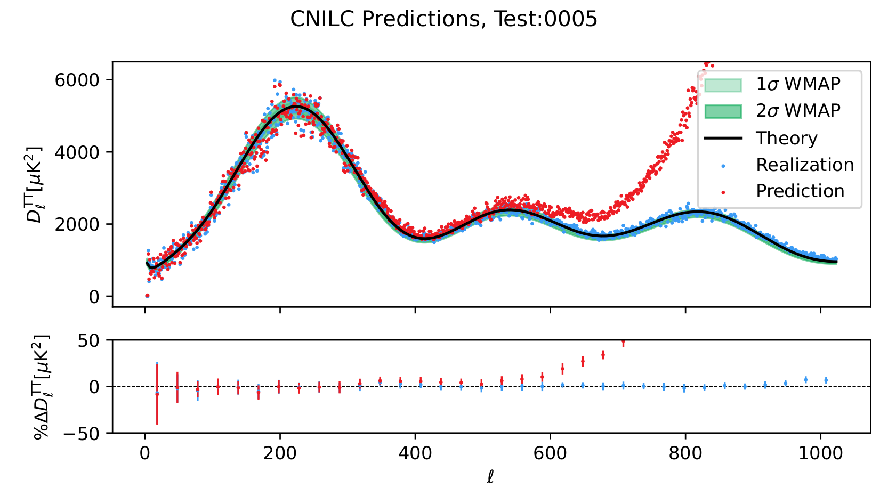

# CMB-ML: A Cosmic Microwave Background Radiation Dataset for Machine Learning

ZENODO (DOI) BADGE HERE

Contents:
- [Quick Start](#quick-start)
- [Introduction](#introduction)
  - [Simulation](#simulation)
  - [Baseline Models](#baseline-models)
  - [Metrics](#metrics)
- [Installation](#installation)
- [Demonstrations](#Demonstrations)
- [Comparing Results](#comparing-results)
  - [Outside Works](#outside-works)
  - [Errata](#errata)
- [Data File Links](#data-file-links)

# Quick Start

To get started:
- Get this repository
- Set up your Python environment
- Create datasets (Downloading is usually an option; contact the authors of the repository if needed)
- Train models
- Run inference
- Compare results

See [Installation](#installation) and [Demonstrations](#Demonstrations) for more detail.


# Introduction


The Cosmic Microwave Background radiation (CMB) signal is one of the cornerstones upon which modern cosmologists understand the universe. The signal must be separated out from these other natural phenomena which either emit microwave signals or change the CMB signal itself. Modern machine learning and computer vision algorithms are seemingly perfect for the task, but generation of the data is cumbersome and no standard public datasets are available. Models and algorithms created for the task are seldom compared outside the largest collaborations. 

The CMB-ML dataset bridges the gap between astrophysics and machine learning. It handles simulation, modeling, and analysis.

This is somewhat complicated. We hope that the structure of CMB-ML gives you an opportunity to focus on a small portion of the pipeline. For many users, we expect this to be the modeling portion. Several examples are presented, showing how different methods can be used to clean the CMB signal. Details are provided below and in ancilliary material for how to acquire the dataset, apply a cleaning method, and use the analysis code included.

Other portions of the pipeline may also be changed. Simulated foregrounds can be changed simply with different parameters for the core engine. With more work, alternative or additional components can be used, or the engine itself can be changed out. A couple noise models particular to the Planck mission have been developed. At the other end of the pipeline, the analysis methods can be altered to match different methods. We are currently improving this portion of the pipeline.

A goal of this project has been to encapsulate the various stages of the pipeline separately from the operational parameters. It is our hope that this enables you to easily compare your results with other methods.

Several tools enable this work. [Hydra](https://hydra.cc/) is used to manage manage a pipeline so that coherent configurations are applied consistently. It uses the [PySM3](https://pysm3.readthedocs.io/en/latest/) simulation library in conjunction with [CAMB](https://camb.info/), [astropy](https://www.astropy.org/), and [Healpy](https://healpy.readthedocs.io/en/latest/) to handle much of the astrophysics. Three baselines are implemented, with more to follow. One baseline comes from astrophysics: [PyILC](https://github.com/jcolinhill/pyilc)'s implementation of the CNILC method. Another baseline uses machine learning: [cmbNNCS](https://github.com/Guo-Jian-Wang/cmbnncs)'s UNet8. A third is a simple [PyTorch](https://pytorch.org/) UNet implementation intended to serve as a template. The analysis portion of the pipeline uses a few simple metrics from [scikit-learn](https://scikit-learn.org/stable/) along with the astrophysics tools.

## Simulation



The real CMB signal is observed at several microwave wavelengths. To mimic this, we make a ground truth CMB map and several contaminant foregrounds. We "observe" these at the different wavelengths, where each foreground has different levels. Then we apply instrumentation effects to get a set of observed maps. The standard dataset is produced at a low resolution, so that many simulations can be used in a reasonable amount of space.

## Cleaning

Two models are included as baselines in this repository. One is a classic astrophysics algorithm, a flavor of **i**nternal **l**inear **c**ombination methods, which employs **c**osine **n**eedlets (CNILC). The other is a machine learning method (a UNet) implemented and published in the astrophysics domain, CMBNNCS. 

The CNILC method was implemented by [PyILC](https://github.com/jcolinhill/pyilc), and is described in [this paper](https://arxiv.org/abs/2307.01043).

The cmbNNCS method was implemented by [cmbNNCS](https://github.com/Guo-Jian-Wang/cmbnncs), and is described in [this paper](https://iopscience.iop.org/article/10.3847/1538-4365/ac5f4a).

The third method, the [PyTorch](https://pytorch.org/) implementation of a UNet, is very similar to cmbNNCS and many other published models. Unlike cmbNNCS, it operates on small patches of maps instead of the full sky.

## Analysis

We can compare the CMB predictions to the ground truths in order to determine how well the model works. However, because the models operate in fundamentally different ways, care is needed to ensure that they are compared in a consistent way. We first mask each prediction where the signal is often to bright to get meaningful predictions. We then remove effects of instrumentation from the predictions. The pipeline set up to run each method is then used in a slightly different way, to pull results from each method and produce output which directly compares them. The following figures were produced automatically by the pipeline, for quick review.




Other figures are produced of summary statistics, but these are far more boring (for now!).

# New Methods

TODO: Update this section.
<!-- We encourage you to first familiarize yourself with the content of the tutorial notebooks and Hydra. Afterwards, you may want to follow either the patterns set in either the [classic method](cmbml/demo_external_method) or [ML method](cmbml/demo_patch_nn/) demonstrations. The main difference between these is the amount of stuff you want to do within CMB-ML's pipeline; if you already have code that can take input parameters, the patterns for classic methods may be more appropriate.

At this time, the classic method patterns are non-functional suggestions. To see operational code, the PyILC method works (very well!). Please excuse any confusion caused by the hoops which enable us to run it on many simulations at once. Start with the [first top-level script](main_pyilc_predict.py), which gets the pipeline through the cleaning process. Then the [second top-level script](main_pyilc_analysis.py) must be run to finish the process. Both of these scripts use the same configuration file, there is simply a conflict in execution due to settings of `matplotlib`.

All of the ML patterns are functional. We suggest using the demonstration network as a prototype. The pipeline overview is in the [top-level script](main_patch_nn.py). This network operates on patches of sky maps, cut directly from the HEALPix arrangement. Some preprocessing stages are needed to enable fast training. The training and prediction executors follow common PyTorch design patterns ([train](cmbml/demo_patch_nn/stage_executors/E_train.py) and [predict](cmbml/demo_patch_nn/stage_executors/F_predict.py)). Both training and prediction use subclasses of a PyTorch [Dataset](https://pytorch.org/tutorials/beginner/basics/data_tutorial.html).

As an alternative, see the cmbNNCS [top-level script](main_cmbnncs.py). The executors for this method are very similar to the demonstration network, though some changes are needed in order to adhere to the method described in the paper. It does differ more significantly in the [predict](cmbml/cmbnncs/stage_executors/E_predict.py) stage, as this model predicts entire skymaps in a single operation. -->

# Installation

Installation of CMB-ML requires setting up the repository, then getting the data assets for the portion you want to run. Demonstrations are available with practical examples. The early ones cover how to set up CMB-ML to run on your system.

<!-- NEW INSTRUCTIONS: -->
- Assuming you install all your repos in the same directory, e.g. `~/repos/`
    - Go to that folder `cd ~/repos`
- Get the latest PySM3
    - The version installed by conda is a few updates behind, including one that fixes a bug in CMBLensed
    - If not yet acquired:
        - `cd ~/repos`
        - `git clone https://github.com/galsci/pysm.git`
    - If acquired, update it:
        - `cd ~/repos/pysm`
        - `git pull`
- Download the CMB-ML repository
    - `cd ~/repos` (or whatever top-level repo folder you use)
    - `git clone git@github.com:CMB-ML/cmb-ml.git`
    - `cd cmb-ml`
    - `git switch whatever`
- Create the conda environment 
    - remove old conda installations (and Poetry... which can be gotten rid of as a whole)
        - `conda env remove -n cmb-ml`
    - still required due to either namaster or torch... this could be fixed soon, possibly
    - `conda env create -f env.yaml`
    - To change the name of the environment, edit the file or use a different command.
- Activate the conda environment
    - `conda activate cmb-ml`
- Install CMB-ML
    - `which pip` (ensure that the response is within the conda environment)
    - `pip install .` OR
    - `pip install -e .` (if you expect to want to update the cmbml code, recommended currently/internally while under extensive development)
    - I have noticed that VS Code does not work well with code installed in editable mode; I will often switch between the modes using:
      - `pip uninstall cmbml`
- Install pysm3
    - `cd ~/repos/pysm` (substitute as needed)
    - `pip install .`

Tutorial notebooks are in https://github.com/CMB-ML/cmb-ml-tutorials.git.
The PatchNN method is https://github.com/CMB-ML/cmb-ml-patch-nn.git
The cmbNNCS method is https://github.com/CMB-ML/cmb-ml-cmbnncs.git.
The PyILC method is https://github.com/CMB-ML/cmb-ml-pyilc.git.

## Notes on Running Simulations

- Generating the set of simulations takes considerable time, due to the large number.
- Downloading them is likely to be faster.
- When generating simulations for the first time, [PySM3](https://pysm3.readthedocs.io/en/latest/) relies on [astropy](https://www.astropy.org/) to download and cache template maps.
  - These will be stored in an `.astropy` directory.
  - Downloading templates is sometimes interrupted resulting in an error and the code crashing. It is annoying and beyond our control. However, because the templates are cached, the pipeline can be resumed and will proceed smoothly.

## For CMB_ML_512_1450

- Download CMB_ML_512_1450
  - [Use the downloading script](./get_data/get_dataset.py)
  - `python ./get_data/get_dataset.py`
  - Files are visible at this [Box link for CMB_ML_512_1450](https://utdallas.box.com/v/cmb-ml-512-1450)
  - Alternatively, to generate simulations, use `python main_sims.py`
  
## For CMB_ML_128_1450

This will run more quickly than the higher resolution.

- Download CMB_ML_128_1450:
  - [Use the downloading script](./get_data/get_box_CMB_ML_128_1450.py)
    - Change [cfg/pipeline/pipe_raw.yaml](../cfg/pipeline/pipe_raw.yaml) to use the correct set of shared links. In this yaml, look for `download_sims_reference` and change the `path_template`.
    - `path_template` should be set based on whatever file you need.
    - Be sure to change `config_sim.yaml` to write to the correct dataset folder! By default it will save to the 512 dataset folder; there's currently no check against this.
  - Files are visible at this [Box link for CMB_ML_128_1450](https://utdallas.box.com/v/cmb-ml-128-1450)
  - Alternatively, to generate simulations, use `python main_sims.py dataset_name=CMB_ML_128_1450 nside=128`
- Run CMBNNCS on CMB_ML_128_1450 (the smaller UNet5 must be used):
    - `python main_cmbnncs.py dataset_name=CMB_ML_128_1450 working_dir=CMBNNCS_UNet5/ nside=128 num_epochs=2 use_epochs=[2] model/cmbnncs/network=unet5`
- Run PyILC on CMB_ML_128_1450:
    - `python main_pyilc_predict.py dataset_name=CMB_ML_128_1450 nside=128 ELLMAX=382 model.pyilc.distinct.N_scales=5 model.pyilc.distinct.ellpeaks=[100,200,300,383]`
    - `python main_pyilc_analysis.py dataset_name=CMB_ML_128_1450 nside=128 ELLMAX=382 model.pyilc.distinct.N_scales=5 model.pyilc.distinct.ellpeaks=[100,200,300,383]`
    - An even faster method is available, using PyILC's HILC method.
- Run Comparison:
    - `python main_analysis_compare.py --config-name config_comp_models_t_128` 

# Comparing Results

The below is list of best results on the dataset. Please contact us through this repository to have your results listed. We do ask for the ability to verify those results.

We list below the datasets and model's aggregated (across the Test split) performance. We first calculate each measure for each simulation. The tables below contain average values of those for each metric. The metrics currently implemented are Mean Absolute Error (MAE), Mean Square Error (MSE), Normalized Root Mean Square Error (NRMSE), and Peak Signal-to-Noise Ratio (PSNR). The first three give a general sense of precision. PSNR gives a worst instance measure.

## On TQU-512-1450

### Pixel Space Performance

| Model   | MAE                    | RMSE                  | NRMSE                    | PSNR                  |
|---------|------------------------|-----------------------|--------------------------|-----------------------|
| CMBNNCS | $\bf{25.25 \pm 0.29}$  | $\bf{31.69 \pm 0.36}$ | $\bf{0.3039 \pm 0.0040}$ | $\bf{30.25 \pm 0.33}$ |
| CNILC   | $32.28 \pm 0.44$       | $40.52 \pm 0.55$      | $0.3885 \pm 0.0043$      | $28.89 \pm 0.60$      |


# Outside Works

CMB-ML was built in the hopes that researchers can compare on this as a standard. In the future, we hope to add more datasets. If you would like your model or dataset listed, please contact us.

## Works using datasets from this repository

None so far!

# Errata

February 2025: 
- The repository history was edited to reduce the `.git` size.
  - The `.git` information was **300 MB**, due to several maps and large python notebooks.
  - It has been reduced to **21 MB**.  The bulk of this is images for this README and the demonstration notebooks.

November 2024: New dataset released:
- The noise generation procedure has been revised to be non-white noise
- The detector FWHM's were changed
  - Previously they were sub-pixel
  - They are now larger and still vary
  - More details [here](assets/CMB-ML/README.txt)
- The CMB signal was changed away from and returned to using CMBLensed
- Because the work is still unpublished and we do not know of anyone else using it, references to previous datasets have been updated. The original dataset will be removed June 30, 2025, unless we're made aware of anyone using it.

# Data File Links

We provide links to the various data used. Alternatives to get this data are in `get_data` and the `Demonstrations`. "Science assets" refers to data created by long-standing cosmological surveys.

- Science assets
  - From the source
    - Planck Maps
      - Planck Collaboration observation maps include variance maps needed for noise generation:
        - [Planck Collaboration Observation at 30 GHz](https://irsa.ipac.caltech.edu/data/Planck/release_3/all-sky-maps/maps/LFI_SkyMap_030-BPassCorrected_1024_R3.00_full.fits)
        - [Planck Collaboration Observation at 44 GHz](https://irsa.ipac.caltech.edu/data/Planck/release_3/all-sky-maps/maps/LFI_SkyMap_044-BPassCorrected_1024_R3.00_full.fits)
        - [Planck Collaboration Observation at 70 GHz](https://irsa.ipac.caltech.edu/data/Planck/release_3/all-sky-maps/maps/LFI_SkyMap_070-BPassCorrected_1024_R3.00_full.fits)
        - [Planck Collaboration Observation at 100 GHz](https://irsa.ipac.caltech.edu/data/Planck/release_3/all-sky-maps/maps/HFI_SkyMap_100_2048_R3.01_full.fits)
        - [Planck Collaboration Observation at 143 GHz](https://irsa.ipac.caltech.edu/data/Planck/release_3/all-sky-maps/maps/HFI_SkyMap_143_2048_R3.01_full.fits)
        - [Planck Collaboration Observation at 217 GHz](https://irsa.ipac.caltech.edu/data/Planck/release_3/all-sky-maps/maps/HFI_SkyMap_217_2048_R3.01_full.fits)
        - [Planck Collaboration Observation at 353 GHz](https://irsa.ipac.caltech.edu/data/Planck/release_3/all-sky-maps/maps/HFI_SkyMap_353-psb_2048_R3.01_full.fits)
        - [Planck Collaboration Observation at 545 GHz](https://irsa.ipac.caltech.edu/data/Planck/release_3/all-sky-maps/maps/HFI_SkyMap_545_2048_R3.01_full.fits)
        - [Planck Collaboration Observation at 847 GHz](https://irsa.ipac.caltech.edu/data/Planck/release_3/all-sky-maps/maps/HFI_SkyMap_857_2048_R3.01_full.fits)
      - For the mask:
        - [Planck Collaboration NILC-cleaned Map](https://irsa.ipac.caltech.edu/data/Planck/release_3/all-sky-maps/maps/component-maps/cmb/COM_CMB_IQU-nilc_2048_R3.00_full.fits)
      - WMAP9 chains for CMB simulation:
        - [WMAP9 Chains, direct download](https://lambda.gsfc.nasa.gov/data/map/dr5/dcp/chains/wmap_lcdm_mnu_wmap9_chains_v5.tar.gz)
      - Planck delta bandpass table:
        - [Planck delta bandpass table, from Simons Observatory](https://github.com/galsci/mapsims/raw/main/mapsims/data/planck_deltabandpass/planck_deltabandpass.tbl)
      - CMB-ML delta bandpass table:
        - [Original delta bandpass table, from Simons Observatory](assets/delta_bandpasses/CMB-ML/cmb-ml_deltabandpass.tbl)
          - CMB-ML modifies these instrumentation properties
        - Simply move the CMB-ML directory contained in assets/delta_bandpasses to your assets folder (as defined in e.g., [your local_system config](cfg/local_system/generic_lab.yaml))
      - [Downloading script](./get_data/get_assets.py)
  - On Box: 
    - [All Science Assets](https://utdallas.box.com/v/cmb-ml-science-assets)
    - Script to be replaced if needed. Please send a message if so.
    <!-- - [Downloading script](./get_data/get_assets.py) -->

- Datasets
  - CMB_ML_512_1450
    - Individual files: [Box Link, CMB_ML_512_1450](https://utdallas.box.com/v/cmb-ml-512-1450)
      - Each simulation instance is in its own tar file and will need to be extracted before use
      - The power spectra and cosmological parameters are in Simulation_Working.tar.gz
      - Log files, including the exact code used to generate simulations, are in Logs.tar.gz. No changes of substance have been made to the code in this archive.
      - A script for these download is available [here](./get_data/get_dataset.py)
  - CMB_ML_128_1450
    - Lower resolution simulations ($\text{N}_\text{side}=128$), for use when testing code and models
    - Individual instance files: [Box Link, CMB_ML_128_1450](https://utdallas.box.com/v/cmb-ml-128-1450)
    - A script for these download is available [here](./get_data/get_box_CMB_ML_128_1450.py)
    - Change [cfg/pipeline/pipe_sim.yaml](./cfg/pipeline/pipe_sim.yaml) to use the correct set of shared links. In this yaml, look for download_sims_reference and change the path_template (replace '512' with '128').

  - Files are expected to be in the following folder structure, any other structure requires changes to the pipeline yaml's:
```
└─ Some Particular Dataset (e.g., I_512_1450)
   ├─ Simulations
   |   ├─ Train
   |   |     ├─ sim0000
   |   |     ├─ sim0001
   |   |     └─ etc...
   |   ├─ Valid
   |   |     ├─ sim0000
   |   |     ├─ sim0001
   |   |     └─ etc...
   |   └─ Test
   |         ├─ sim0000
   |         ├─ sim0001
   |         └─ etc...
   └─ Simulation_Working
       ├─ Simulation_B_Noise_Cache
       ├─ Simulation_C_Configs            (containing cosmological parameters)
       └─ Simulation_CMB_Power_Spectra
```

- Trained models
  - CMBNNCS
    - [UNet8 trained on CMB_ML_512_1450, at various epochs](https://utdallas.box.com/v/ml-cmb-UNet8-IQU-512-1450-bl)
